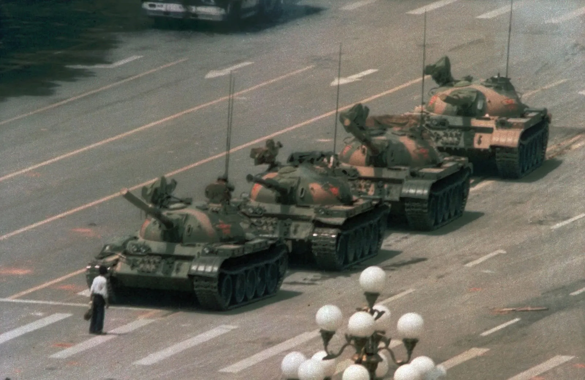

# GL5-ethics-project

## Introduction

Before we dive into the rise of artificial intelligence in China, we need to explore existing policies and the political climate in China, but before we do, I'd like to refer to a novel called 1984 and have you draw the parallels.

## Nineteen Eighty-Four

**Big brother is watching background**

[The Dystopian World of 1984 Explained - YouTube](https://www.youtube.com/watch?v=GQxOKXEff4I)

Nineteen Eighty-Four is a famous novel written by X. It revolves around a world living in a dystopian future where utilitarianism rains, individualism is dead, and reality alongside history are just a matter of opinion.

Constant surveillance of every citizen is the norm.

The control of information to the point where facts are not reality and reality can be changed at the whim of Big Brother and the "party".
The party has a monopoly on facts and political discourse ( debates )

society is divided into 3

- Inner party 2%

- outer party 13% ( bureaucrats )

- the proles, easy to manipulate: creating a fake crisis, nationalistic pandering, a common enemy

what this has to do with china? **everything**

## Internet control and the great firewall: controlling the truth

<https://nebula.tv/videos/theexploration-how-china-controls-the-internet>

**tankman background**

What happened in June 1989 at Tiananmen Square?

**Absolutely nothing**

As we all know China blocks Facebook, Twitter, Google, and Wikipedia ... but that can be easily evaded by paying a few dollars a month for a VPN. Thus, does china **really** control the internet?

How can it control the Internet without giving the average citizen the impression that it does?

The golden shield project or what's known today as the great firewall

- site blocking

- topic filtering

- Search result rearrangement

- mass surveillance

Each company in China is required to hire "content moderators" or what's better known as "sensors". The official number of those workers is **2 millions****.

Here's the thing, complaining about the government is allowed and most of the time turned a blind eye to it but **mobilizing people through** a rally is **strictly** censored.

China is close to finding common ground to maintain control over the expression of opinions, but without letting them act on these opinions.

By law, the browsing activity of everyone is collected by the internet provider and passed to the government. With the rising of big data and data analysis, we can all see what's wrong with this.

In the book "censored distraction and diversion inside china's great firewall" 3 methods are described on how the government controls the internet :

- Fear & threats
  
  - Effective immediately but there's a reaction of people trying to seek out information if they feel the government is sensitive about it being seen.
  
  - Only used for protestors and journalists

- Flooding
  
  - Drow up critical thoughts in a see of pro gov messages using internet trolls and a load of opposing article

- Friction
  
  - Increase the cost of finding information
  
  - Make parts of applications slower
  
  - Ban website with the knowledge of existing VPNs
  
  - This strategy is most popular and relies on our lack of patience
  
  - The average citizen will just use the service that "just works" and mostly it is government controlled platform

So do you think that's dystopian enough? we just started.

## The social credit system: Big data meets Big brother

<https://nebula.tv/videos/real-life-lore-yt-what-life-under-china-s-social-credit-system-could-be-like>

What if every action you took in your life was recorded in a score like a video game?

- Good actions raise your score

- Bad actions lower your score

- Your scope can be looked up online

**Your score is used to judge you**

A new episode of black mirror ? Certainly not for 17% of the human population

Introducing the social credit system

Big brother is giving you a score through a load of personal data:

- Financial and criminal records

- online search history

- social media posts

The government will score based on what it deems **better social behavior** and a bad score will make your life **HARDER**

- Ban on using public transport

- Ban on flight and exit visa

- losing access and children's access to university

- Ban on dating apps

Some of these activities are but are not limited to:

- Donating blood

- Volunteer work

- Paying bills on time

- Being a model employee

Looking good, isn't it? Some other activities can help too:

- Praising the government online

- Praising the crackdown on political and religious "extremes"

But some of the bad activities consist of:

- cheating at video game

- Playing an excessive amount of video games

- Participating in a "cult"

- missing on appointments

- Spreading "fake news"

- not visiting your parents

- participating in protests against the Chinese authority

How is it powered

**620 million CCTV cameras nationwide** That's a camera for every two persons in china all capable of real-time facial recognition
The results?

28 million banned sales of airplane tickets

Things are getting closer and closer to 1984. Let's now explore The age of artificial intelligence

## The age of artificial intelligence:  1984 is 2022

<https://www.youtube.com/watch?v=CLo3e1Pak-Y>
In previous years the Chinese government has collected a tremendous amount of data alongside personal identifying information for every citizen as every person is required to have a state-issued ID card which enables mass surveillance in real-time.

Let's explore some real-world applications

### Jaw walking

crossing the street illegally in china (at a red light) will result in a camera taking a photo of you, identifying you instantly and issuing a fine alongside a public display of your face on the screen of the crosswalk

### Pay with your face

Payment technologies using facial recognition are slowly becoming the norm in china

### Toilet paper waste control

In a lot of public places you can not get toilet paper without identifying your face

### Office Monitoring

Cameras enable employers to check employee entry and leave time, their mood and their productivity

### Searching

600 million CCTV country-wide enable the government to easily find any target ( a person, a car) and monitor their movement in nearly real time

### Crowd control

AI can monitor crowds for their size and the period each person has stayed in the same zone detecting unusual activities (protests) in real-time allowing action to be taken immediately with minimal damage
Government housing (Dorms)

Cameras monitor the residential complexes and control access to houses. It keeps track of the number of visitors and unusual activities of residents

---

### Negvi & skynet

A rising tech company specialized in video stream processing and cross-checking facial data against enormous government databases being mainly oriented at criminal databases.
A million dollars  investment from the Chinese government

3000 cases have been caught in 2021 using this system ironically called Skynet

### Education

**Certain** private experimental schools are using headbands and cameras to monitor students during class.
Certain devices can check brain activity through their electric signals and the data is sent to the teacher's computer in real-time making him able to distinguish who's paying attention and who is not using AI-based pattern recognition.
